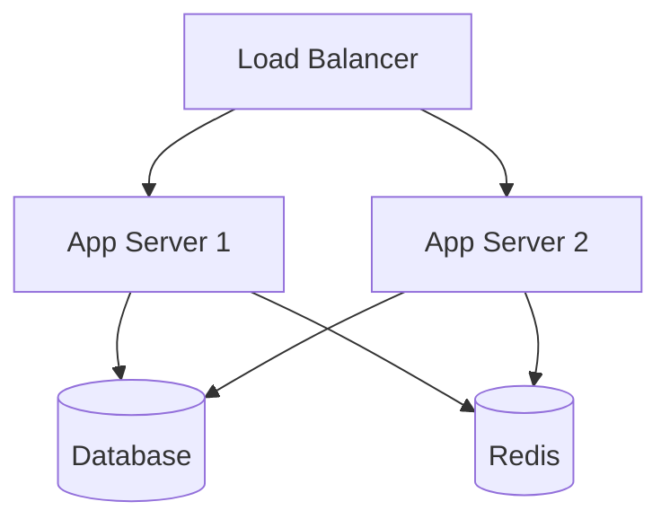

# Magento 2 3-Tier Architecture

## Infrastructure Overview


### Component Details

**Application Servers (2+)**
- **Nginx**: v1.18+ with HTTP/2 support
- **PHP**: 8.2 FPM with OPcache
- **Magento**: 2.4.6 in production mode
- **Connections**: 
  - MySQL → Database Server
  - Redis → Cache Server

**Database Server**
- **MySQL**: 8.0 with InnoDB tuning
- **Storage**: Minimum 100GB SSD
- **Security**: IP-restricted access

**Redis Server**
- **Version**: 6.2+
- **Memory**: Dedicated 2GB+ 
- **Databases**:
  - 0: Sessions
  - 1: Default cache
  - 2: Page cache

## Traffic Flow
1. User → Load Balancer (HTTPS)
2. LB → Nginx (App Server)
3. Nginx → PHP-FPM
4. PHP-FPM → Redis (Cache)
5. PHP-FPM → MySQL (Persistence)

## Security Layers
- **TLS**: End-to-end encryption
- **Firewall**: Port restrictions
- **Isolation**: Separate service tiers
- **Hardening**: SSH, Fail2ban, service-specific protections
```

## 2. `docs/post-install.md`
```markdown
# Post-Installation Steps

## Mandatory Configurations

1. **SSL Certificate**
```bash
sudo certbot --nginx -d magento.example.com
```

2. **Load Balancer Setup** (Example: Nginx LB)
```nginx
upstream magento_backend {
    server app1.example.com:80;
    server app2.example.com:80;
    keepalive 32;
}

server {
    listen 443 ssl;
    server_name magento.example.com;
    
    ssl_certificate /etc/letsencrypt/live/magento.example.com/fullchain.pem;
    ssl_certificate_key /etc/letsencrypt/live/magento.example.com/privkey.pem;

    location / {
        proxy_pass http://magento_backend;
        proxy_set_header Host $host;
        proxy_set_header X-Real-IP $remote_addr;
    }
}
```

## Monitoring Setup

**Required Checks:**
- Database replication lag
- Redis memory usage
- PHP-FPM process status
- Magento cron jobs

## Backup Strategy

1. **Database Daily Backup**
```bash
mysqldump -u root -p magento | gzip > /backups/magento-db-$(date +%F).sql.gz
```

2. **Magento Files Backup**
```bash
tar -czf /backups/magento-files-$(date +%F).tar.gz /var/www/magento
```

## Maintenance Commands

**Cache Management**
```bash
php /var/www/magento/current/bin/magento cache:{flush|clean|enable|disable}
```

**Reindexing**
```bash
php /var/www/magento/current/bin/magento indexer:reindex
```

## Troubleshooting

**Common Issues:**
1. **Redis Connection Failures**
   - Verify `redis_password` in `app/etc/env.php`
   - Check Redis server memory usage

2. **Database Timeouts**
   - Review MySQL slow query log
   - Optimize long-running queries

3. **Static Content 404s**
```bash
php bin/magento setup:static-content:deploy -f
```
```